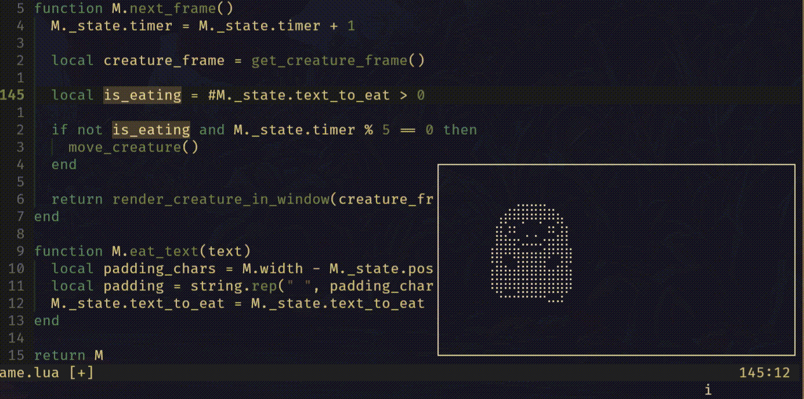

# Vimagtochi

## Demo



## Instalation

```lua
{
  "adomurad/vimagotchi",
  config = function()
    require('vimagotchi').setup {}

    require('vimagotchi').open()
  end,
}
```

## Options

Default options:

```lua
require('vimagotchi').setup {
  eat_on = {
    delete = true,
    change = false,
    yank = false,
  },
}
```

## Commands

### Open the Vimagotchi window

```
:Vimagotchi Open
```

### Close the Vimagotchi window

```
:Vimagotchi Close
```

